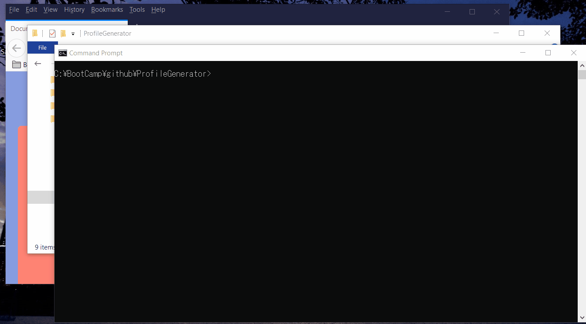

# ProfileGenerator
A command-line application that dynamically generates a PDF profile from a GitHub username.

## Setup
1. Install node.js https://nodejs.org

2. Install npm. Open command prompt or terminal and enter as follows.

$ npm install axios

$ npm install html-pdf

$ npm install path

$ npm install inquirer

## Usage 
1. Open command prompt or terminal and enter as follows.

$ node index.js 

2. Answer questions to the interactive prompt. 
Enter username, Color, PDF Filename and HTML Filename.

3. The specified files are generated by this command line application. 

## Issues
Some functionality does not work due to the bugs of PDF converter.
The converted PDF file does not look same as HTML file, as the converter does not support css flex.  
The PDF converter does not return error, even if you specify an invlid filename is spcified.

## Credit 
https://nodejs.org

https://www.npmjs.com/package/html-pdf

https://www.npmjs.com/package/inquirer

Github API 

## Screenshot 

